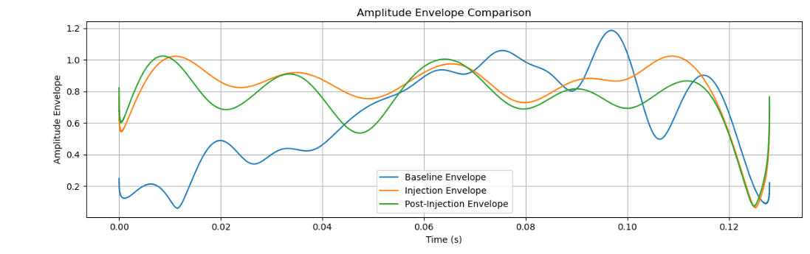

# Svelvik CO₂ Seismic Monitoring

This project analyzes SEG-2 seismic files from the Svelvik CO₂ Field Lab to monitor subsurface changes caused by CO₂ plume migration.

Using Python-based workflows, we inspect, clean, and compare seismic signals from:
- **Baseline data** (pre-injection)
- **Injection data**
- **Post-injection data**

Our goal is to detect and interpret CO₂-related changes using waveform characteristics and signal energy comparison.

---

##  Objective

To detect and interpret plume-related changes in:
- Waveform shape and amplitude
- Signal energy (envelope)
- First arrival time (velocity shift)

---

##  Methodology

We follow a structured pipeline:

```
Files → Inspect → Clean → Compare (Baseline vs Injection) → Interpret (Plume)
```

---

##  Key Findings

### Amplitude Envelope Comparison

Post-injection waveforms show reduced envelope energy, suggesting scattering and attenuation due to plume interaction.



---

### Multi-Trace Overlay

Overlaying traces reveals:
- Arrival time shifts
- Amplitude flattening
- Phase changes

These patterns suggest saturation or gas presence in the plume-affected region.


---

##  Tools & Libraries

- Python 3
- [`ObsPy`](https://github.com/obspy/obspy) – for SEG-2 handling and signal filtering
- `NumPy`, `Matplotlib`, `Seaborn` – for data processing and visualization

---

##  Usage

To reproduce this project:

1. Clone this repository  
2. Place SEG-2 files in a `data/` folder  
3. Run the Jupyter notebook:  
   ```bash
   jupyter notebook Svelvik_CO2_Seismic_Analysis.ipynb
   ```

---

##  Dataset

**Source**: Svelvik CO₂ Field Lab – ECCSEL research site  
**Data**: SEG-2 files (Baseline, Injection, Post-injection)  
**Acknowledgment**:  
> *We acknowledge SINTEF, the ECCSEL Svelvik CO₂ Field Lab, and the Pre-ACT project (RCN project number 271496) for giving access to the data.*

---

##  Summary

This analysis confirms seismic responses related to CO₂ plume migration using envelope comparison and waveform inspection. It provides a foundation for future MMV tools in shallow injection sites.


Explore the full analysis in [Svelvik_CO2_Seismic_Analysis.ipynb](Svelvik_CO2_Seismic_Analysis.ipynb)
---

##  Author

**Anuri Nwagbara**  
Geoscientist | Reservoir & Process Engineering  


---

## 📄 License

This project is licensed under the MIT License.
