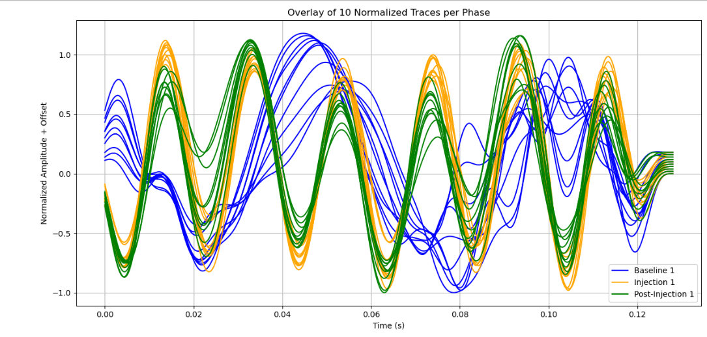

# Svelvik CO₂ Seismic Monitoring

This project applies **time-lapse seismic analysis** techniques to monitor subsurface changes during **CO₂ injection** at the Svelvik CO₂ Field Lab.  
Using Python-based workflows, we inspect, clean, and compare seismic signals to detect plume-related behavior in a shallow reservoir.

It supports the open science goals of **IEAGHG CO₂ DataShare**, providing a reproducible, transparent baseline for future MMV (Monitoring, Measurement & Verification) tool development.

---

##  Objective

To identify and interpret time-lapse changes in seismic responses caused by CO₂ plume migration, focusing on:

- Waveform shape and amplitude differences
- Signal envelope energy (attenuation/scattering)
- First arrival time shifts (velocity anomalies)

---

##  Methodology

We follow a structured workflow:

```
SEG-2 Files → Inspect → Clean → Compare (Baseline vs Injection) → Interpret (Plume Effects)
```

The analysis compares signals from three monitoring stages:

- **Baseline data** (pre-injection)
- **Injection-phase data**
- **Post-injection data**

---

##  Key Findings

###  Amplitude Envelope Comparison

Post-injection waveforms show **reduced signal energy**, consistent with scattering and absorption by the migrating CO₂ plume.


---

###  Multi-Trace Overlay

Overlaying seismic traces reveals:

- **Arrival-time shifts**
- **Amplitude flattening**
- **Phase and frequency changes**

These observations are consistent with plume presence and changes in pore saturation within the injected zone.



---

##  Tools & Libraries

- `ObsPy` – for SEG-2 handling and signal filtering
- `NumPy`, `Matplotlib`, `Seaborn` – for numerical processing and visualization
- `Python 3.x`

---

##  Dataset

**Source**: Svelvik CO₂ Field Lab – ECCSEL Research Site  
**Format**: SEG-2 seismic files (Baseline, Injection, Post-injection)

**Acknowledgment**:  
> *We gratefully acknowledge SINTEF, the ECCSEL Svelvik CO₂ Field Lab, and the Pre-ACT project (RCN project number 271496) for access to the dataset.*

---

##  Potential Applications

- CCS monitoring and plume detection workflows  
- Educational demos for time-lapse seismic analysis  
- Baseline MMV methodology for shallow injection sites  
- Open-source tool contributions for reservoir surveillance

---

##  Usage

To reproduce this analysis:

1. Clone this repository  
2. Place your SEG-2 files in the `data/` directory  
3. Open and run the main notebook:  
   ```bash
   jupyter notebook Svelvik_CO2_Seismic_Analysis.ipynb
   ```

---

##  Summary

This project demonstrates a Python-based, reproducible analysis of seismic signals during CO₂ injection.  
It confirms time-lapse effects consistent with plume behavior and provides an early-stage template for **CCS MMV tools** or applied signal analysis in research settings.

---

##  Author

**Anuri Nwagbara**  
Reservoir & Process Engineer  

