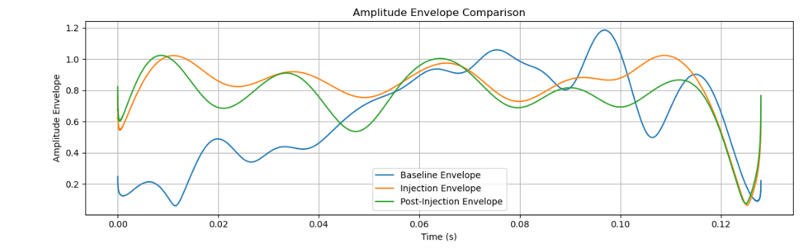
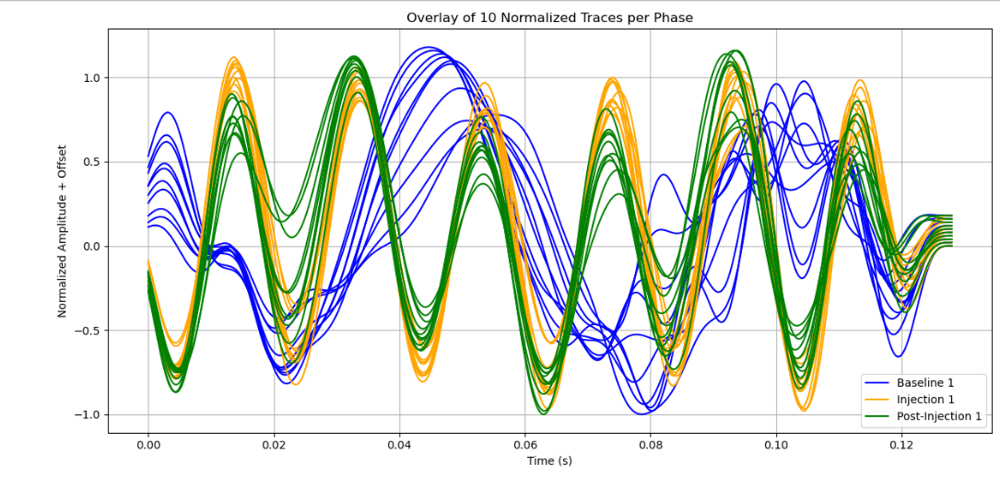

# Svelvik CO₂ Time-Lapse Seismic Analysis

Exploratory **signal-level comparison of cross-well SEG-2 seismic data** acquired before, during, and after the 2019 CO₂ injection campaign at the Svelvik CO₂ Field Lab.

The project focuses on reproducible data handling and comparison of matched source–receiver geometries using Python and ObsPy. It does **not** perform seismic inversion, tomography, plume segmentation, or quantitative CO₂ saturation estimation.

## Scope

The workflow:

- loads SEG-2 records from the baseline, injection, and post-injection surveys;
- removes flat traces;
- matches traces by SEG-2 source/receiver metadata before comparison;
- applies an illustrative 10–100 Hz band-pass filter and per-trace normalisation;
- compares normalised waveform shape and amplitude-envelope shape;
- calculates an automatic STA/LTA first-arrival pick for an example matched geometry;
- overlays matched traces across monitoring phases.

### Important interpretation boundary

The analysis is **exploratory**. Differences between monitoring phases are observations in the processed seismic records; they are not, by themselves, proof that a specific difference was caused by the CO₂ plume.

Two points are especially important:

1. **Per-trace normalisation removes absolute-amplitude information.** The envelope plots can be used to compare waveform/envelope shape, but not to claim quantitative energy loss or attenuation.
2. The example SEG-2 metadata in the original run show different stack counts between phases (baseline: 4; injection/post-injection: 8). Acquisition and processing differences therefore need to be controlled before attributing amplitude or arrival-time changes to subsurface CO₂.

The 10–100 Hz band used here is retained from the original exploratory workflow and should be treated as an analysis choice rather than a calibrated acquisition band. A research-grade interpretation should first inspect the survey documentation and spectral content and justify the filter.

---

## Dataset

**Dataset:** *Svelvik CO₂ Field Lab cross-well data 2019*  
**Format:** SEG-2 / SG2 cross-well seismic data  
**Monitoring phases:** baseline, during injection, post-injection  
**DOI:** `10.11582/2025.00062`

The dataset was acquired during the **Pre-ACT** project at the **Svelvik CO₂ Field Lab** and is distributed through **CO2DataShare**. SINTEF is listed as the contributing organisation, and the field laboratory is part of the ECCSEL research infrastructure.

The raw dataset is **not included in this repository**. Users must obtain it from the dataset provider and comply with the **SVELVIK 2019 DATASET LICENSE**.

The Apache-2.0 licence in this repository applies to the repository code/documentation only; it does not replace or modify the dataset licence.

---

## Repository structure

```text
.
├── README.md
├── Svelvik_CO2_Seismic_Analysis.ipynb
├── requirements.txt
├── .gitignore
├── LICENSE
└── images/
    ├── amplitude_envelope.png
    └── multi_trace_overlay.png
```

Place locally obtained SEG-2 data under:

```text
data/
├── Baseline_data_2019/
├── CO2_injection_data_2019/
└── Post_Injection_data_2019/
```

The `data/` directory and SEG-2 files are ignored by Git.

---

## Example outputs

### Normalised amplitude-envelope comparison



This figure shows **shape differences after per-trace normalisation**. It must not be interpreted as a quantitative comparison of absolute signal energy or attenuation.

### Matched-trace overlay



The overlay visualises differences in normalised waveform shape and relative timing across monitoring phases. The corrected notebook matches source/receiver metadata before building the comparison.

---

## Limitations

- No seismic inversion or tomography
- No plume-zone segmentation
- No velocity-model update
- No quantitative CO₂ saturation or plume-volume estimate
- No causal attribution of individual signal changes to CO₂
- Automatic first-arrival picks are illustrative and require manual/QC validation
- Per-trace normalisation prevents absolute-amplitude comparison
- Acquisition settings, stack counts, geometry and processing choices must be controlled before physical interpretation
- The 10–100 Hz filter is exploratory and has not been presented as an acquisition-calibrated band

---

## Possible extensions

- Spectral analysis with a survey-justified processing band
- Manual/QC validation of first-arrival picks
- Travel-time tomography
- Full waveform or other inversion methods
- Geometry-aware time-lapse differencing
- Uncertainty analysis and repeatability assessment

---

## Author

**Anuri Nwagbara**  
*Geological Engineer*
